praktikum5

## Praktikum5
```
NIM     : 312310576
NAMA    : TAUFIK HIDAYAT
KELAS   : TI.23.A6
MATKUL  : BASIS DATA
DOSEN   : Agung Nugroho, S.Kom., M.Kom.
```
### Soal Latihan
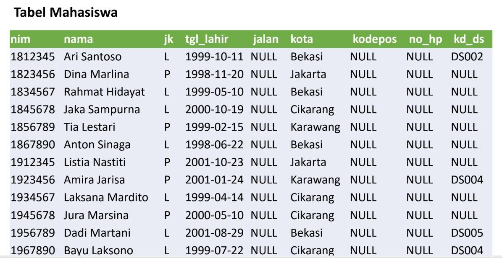
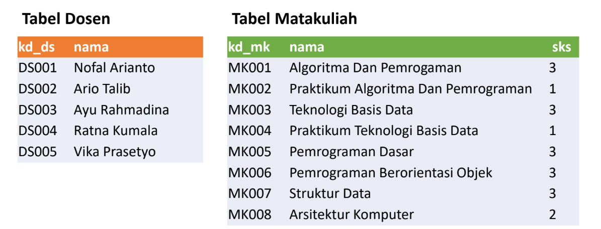
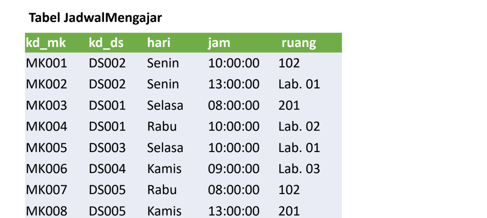
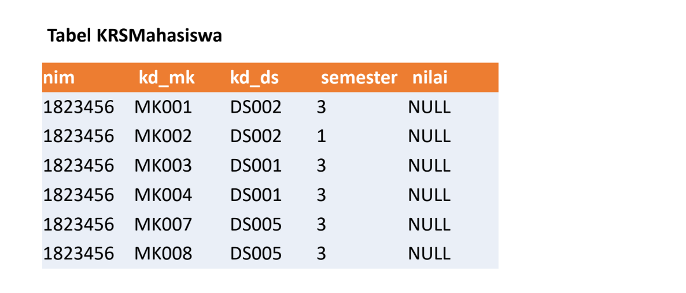
### Tugas Latihan


- Buat Table Mahasiswa
```
CREATE TABLE Mahasiswa(
nim VARCHAR(50) NOT NULL,
nama VARCHAR(100) NOT NULL,
jk VARCHAR(20) NOT NULL,
tgl_lahir VARCHAR(30) NOT NULL,
jalan VARCHAR(30) DEFAULT NULL,
Kota VARCHAR(50) NOT NULL,
kodepos VARCHAR(20) DEFAULT NULL,
no_hp VARCHAR(20) DEFAULT NULL,
kd_ds VARCHAR(20) DEFAULT NULL,
PRIMARY KEY (nim));
```
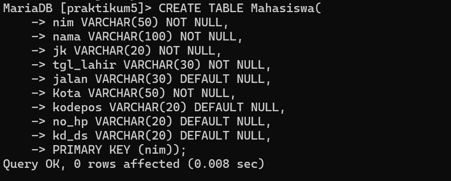
```
INSERT INTO Mahasiswa(nim, nama, jk, tgl_lahir, jalan, kota, kodepos, no_hp, kd_ds) values
('1812345', 'Ari Santoso', 'L', '1999-10-11', NULL, 'Bekasi', NULL, NULL, 'DS002'),
('1823456', 'Dina Marlina', 'P', '1998-11-20', NULL, 'Jakarta', NULL, NULL, NULL),
('1834567', 'Rahmat Hidayat', 'L', '1999-05-10', NULL, 'Bekasi', NULL, NULL ,NULL),
('1845678', 'Jaka Sampurna', 'L', '2000-10-19', NULL, 'Cikarang', NULL, NULL, NULL),
('1856789', 'Tia Lestari', 'P', '1999-02-15', NULL, 'Karawang', NULL, NULL, NULL),
('1867890', 'Anton Sinaga', 'L', '1998-06-22', NULL, 'Bekasi', NULL ,NULL ,NULL),
('1912345', 'Listia Nastiti', 'P', '2001-10-23', NULL,'Jakarta', NULL ,NULL ,NULL),
('1923456', 'Amira Jarisa', 'P', '2001-01-24', NULL, 'Karawang', NULL, NULL, 'DS004'),
('1934567', 'Laksana Mardito', 'L', '1999-04-14', NULL, 'Cikarang', NULL ,NULL ,NULL),
('1945678', 'Jura Marsina', 'p', '2000-05-10', NULL, 'Cikarang', NULL ,NULL ,NULL),
('1956789', 'Dadi Martani', 'L', '2001-08-29', NULL, 'Bekasi', NULL, NULL, 'DS005'),
('1967890', 'Bayu Laksono', 'L', '1999-07-22', NULL, 'Cikarang', NULL, NULL, 'DS004');
```
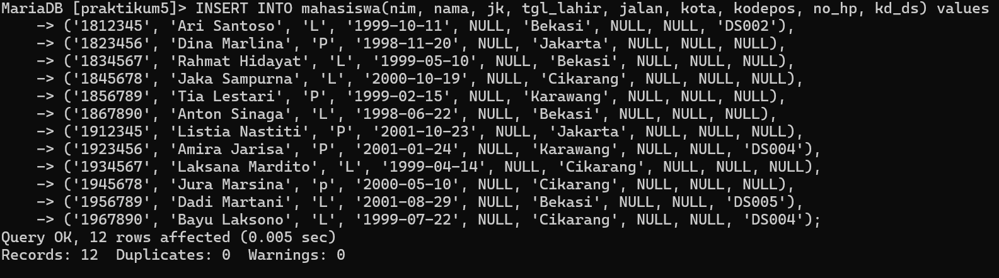
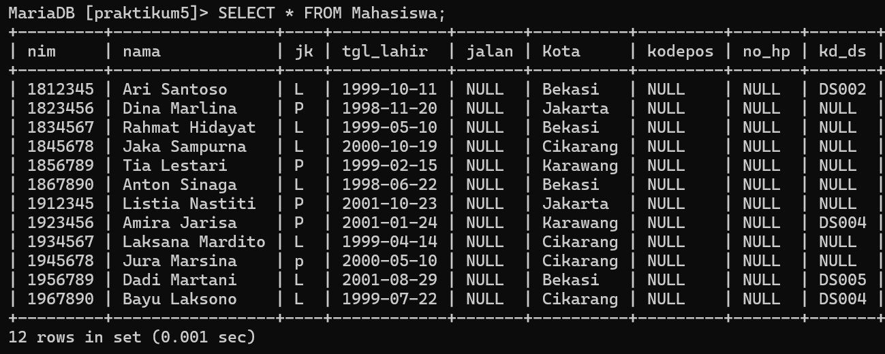


- Table Dosen
```
CREATE TABLE Dosen(
kd_ds VARCHAR(50) NOT NULL PRIMARY KEY,
nama VARCHAR(100) NOT NULL
);
```
```
INSERT INTO dosen (kd_ds, nama) values
('DS001', 'Nofal Arianto'),
('DS002', 'Ario Talib'),
('DS003', 'Ayu Rahmadina'),
('DS004', 'Ratna Kumala'),
('DS005', 'Vika Prasetyo');
```
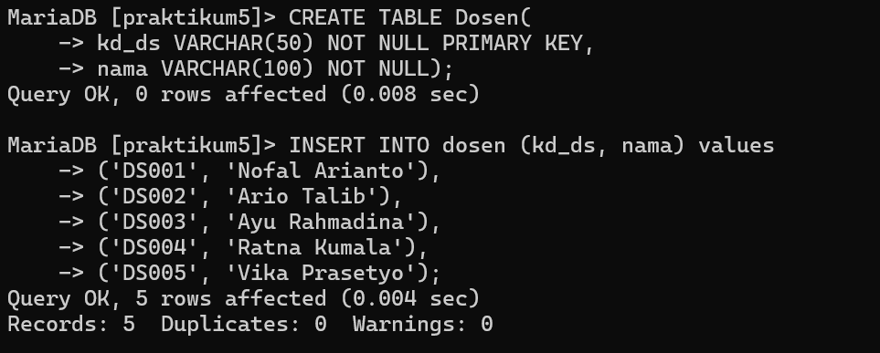
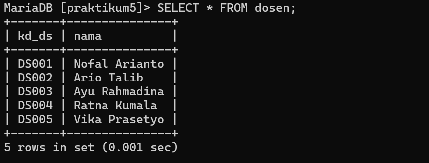


- Table Matakuliah
```
CREATE TABLE Matakuliah(
kd_mk VARCHAR(50) NOT NULL PRIMARY KEY,
nama VARCHAR(100) NOT NULL,
sks VARCHAR(10));
```
```
INSERT INTO Matakuliah (kd_mk, nama, sks) values
('MK001', 'Algoritma Dan Pemrograman', '3'),
('MK002', 'Praktikum Algoritma Dan Pemrograman', '1'),
('MK003', 'Teknologi Basis Data', '3'),
('MK004', 'Praktikum Teknologi Basis Data', '1'),
('MK005', 'Pemrograman Dasar', '3'),
('MK006', 'Pemrograman Berorientasi Objek', '3'),
('MK007', 'Struktur Data', '3'),
('MK008', 'Arsitektur Komputer', '2');
```

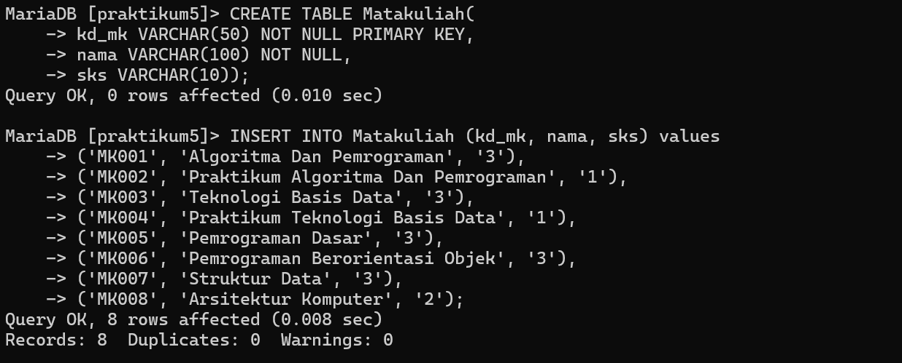
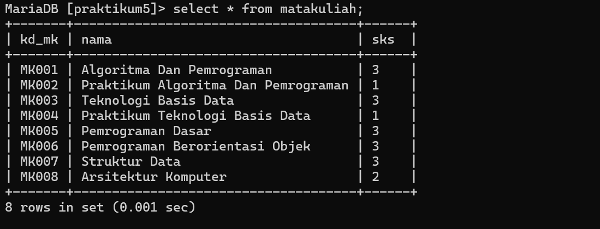


- Table Jadwal Mengajar
```
CREATE TABLE JadwalMengajar(
kd_mk VARCHAR(50) NOT NULL,
kd_ds VARCHAR(50) NOT NULL,
hari ENUM('Senin', 'Selasa', 'Rabu', 'Kamis'),
jam TIME NOT NULL,
ruang VARCHAR(50),
PRIMARY KEY(kd_mk, kd_ds)
);
```
```
INSERT INTO JadwalMengajar(kd_mk, kd_ds, hari, jam, ruang) values
('MK001', 'DS002', 'Senin', '10:00:00', '102'),
('MK002', 'DS002', 'Senin', '13:00:00', 'Lab. 01'),
('MK003', 'DS001', 'Selasa', '08:00:00', '201'),
('MK004', 'DS001', 'Rabu', '10:00:00', 'Lab. 02'),
('MK005', 'DS003', 'Selasa', '10:00:00', 'Lab. 01'),
('MK006', 'DS004', 'Kamis', '09:00:00', 'Lab. 03'),
('MK007', 'DS005', 'Rabu', '08:00:00', '102'),
('MK008', 'DS005', 'Kamis', '13:00:00', '201');
```
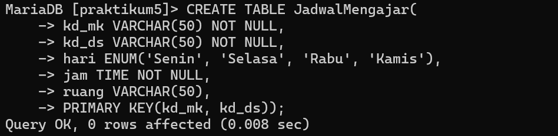
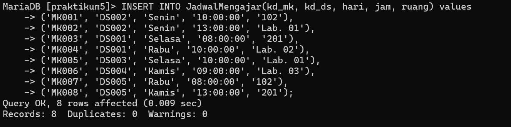
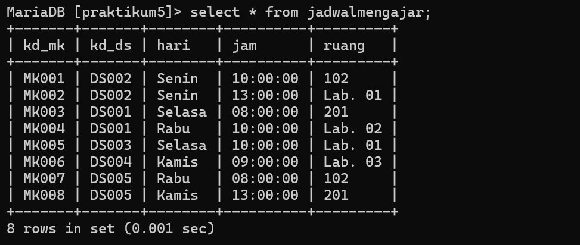


- Table KrsMahasiswa
```
CREATE TABLE KRSMahasiswa(
nim VARCHAR(50) NOT NULL,
kd_mk VARCHAR(50) NOT NULL,
kd_ds VARCHAR(50) NOT NULL,
semester VARCHAR(30) NOT NULL,
nilai VARCHAR(50) DEFAULT NULL);
```
```
INSERT INTO KRSMahasiswa(nim, kd_mk, kd_ds, semester) values
('1823456', 'MK001', 'DS002', '3'),
('1823456', 'MK002', 'DS002', '1'),
('1823456', 'MK003', 'DS001', '3'),
('1823456', 'MK004', 'DS001', '3'),
('1823456', 'MK007', 'DS005', '3'),
('1823456', 'MK008', 'DS005', '3');
```
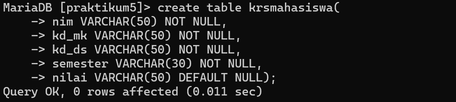
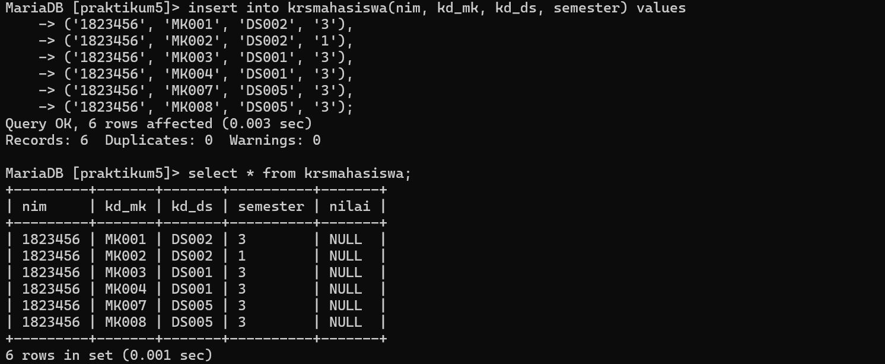

### Tugas latihan
1. Lakukan join table Mahasiswa dan Dosen
- input menggunakan inner join
```
SELECT Mahasiswa.nim, Mahasiswa.nama, Mahasiswa.jk, Dosen.nama AS "Dosen PA"
FROM Mahasiswa INNER JOIN Dosen ON Dosen.kd_ds = Mahasiswa.kd_ds;
```
- output :
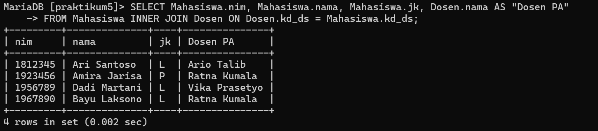
- input dengan left join
```
SELECT Mahasiswa.nim, Mahasiswa.nama, Mahasiswa.jk, Dosen.nama AS "Dosen PA"
FROM Mahasiswa LEFT JOIN Dosen ON Dosen.kd_ds = Mahasiswa.kd_ds;
```
- output :
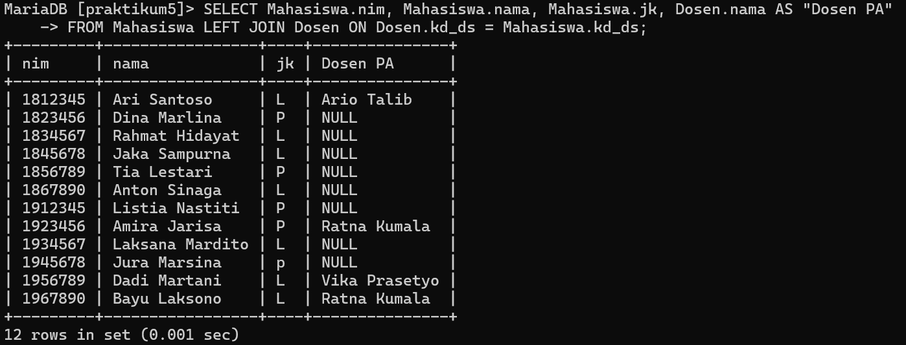

2. Lakukan join table Mata kuliah dan Dosen
- input
```
SELECT Matakuliah.kd_mk, Matakuliah.nama, Matakuliah.sks, Dosen.nama AS "Dosen Pengampu"
FROM JadwalMengajar
LEFT JOIN Matakuliah ON JadwalMengajar.kd_mk = Matakuliah.kd_mk
LEFT JOIN Dosen ON JadwalMengajar.kd_ds = Dosen.kd_ds;
```
- output :
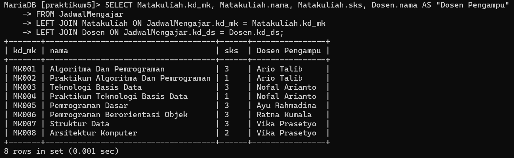

3. Lakukan join table Jadwal Mengajar, Dosen dan Matakuliah
- input
```
SELECT Matakuliah.kd_mk, Matakuliah.nama, Matakuliah.sks, Dosen.nama AS "Dosen Pengampu", JadwalMengajar.hari, JadwalMengajar.jam, JadwalMengajar.ruang
FROM JadwalMengajar
LEFT JOIN Matakuliah ON JadwalMengajar.kd_mk = Matakuliah.kd_mk
LEFT JOIN Dosen ON JadwalMengajar.kd_ds = Dosen.kd_ds;
```
- output :
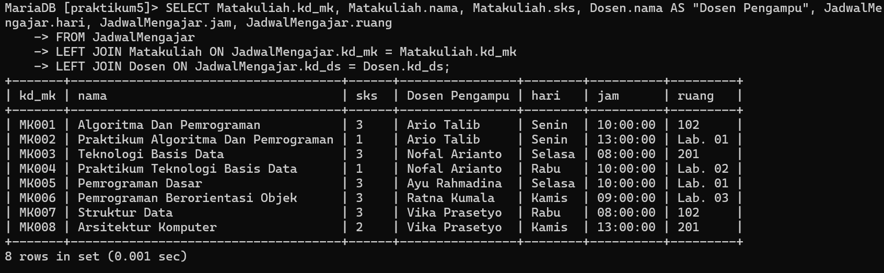

4. Lakukan join table KRSMahasiswa, Mahasiswa, Matakuliah Dan Dosen
- input
```
SELECT Mahasiswa.nim, Mahasiswa.nama AS "nama", Dosen.nama AS "Dosen PA", Matakuliah.nama AS "Matakuliah", Matakuliah.sks, Dosen.nama AS "Dosen Pengampu"
FROM KRSMahasiswa
JOIN Mahasiswa ON KRSMahasiswa.nim = Mahasiswa.nim
JOIN Matakuliah ON KRSMahasiswa.kd_mk = Matakuliah.kd_mk
JOIN Dosen ON KRSMahasiswa.kd_ds = Dosen.kd_ds;
```
- output :
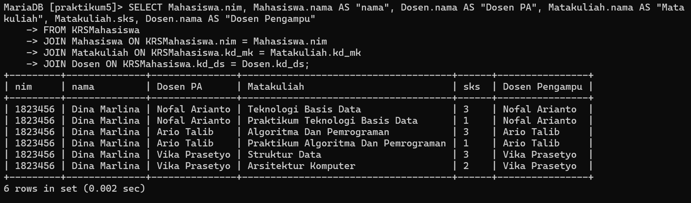
